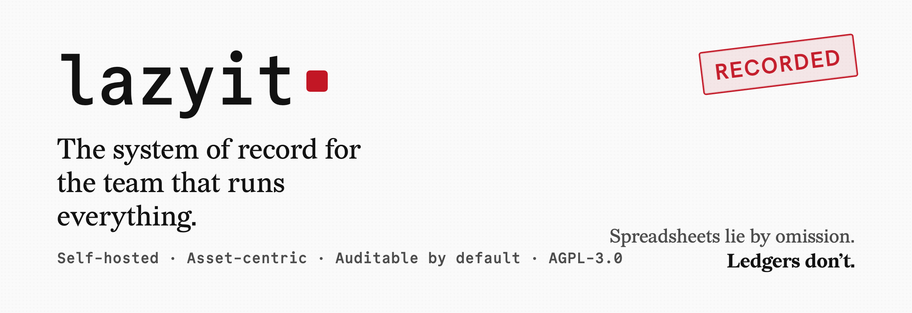
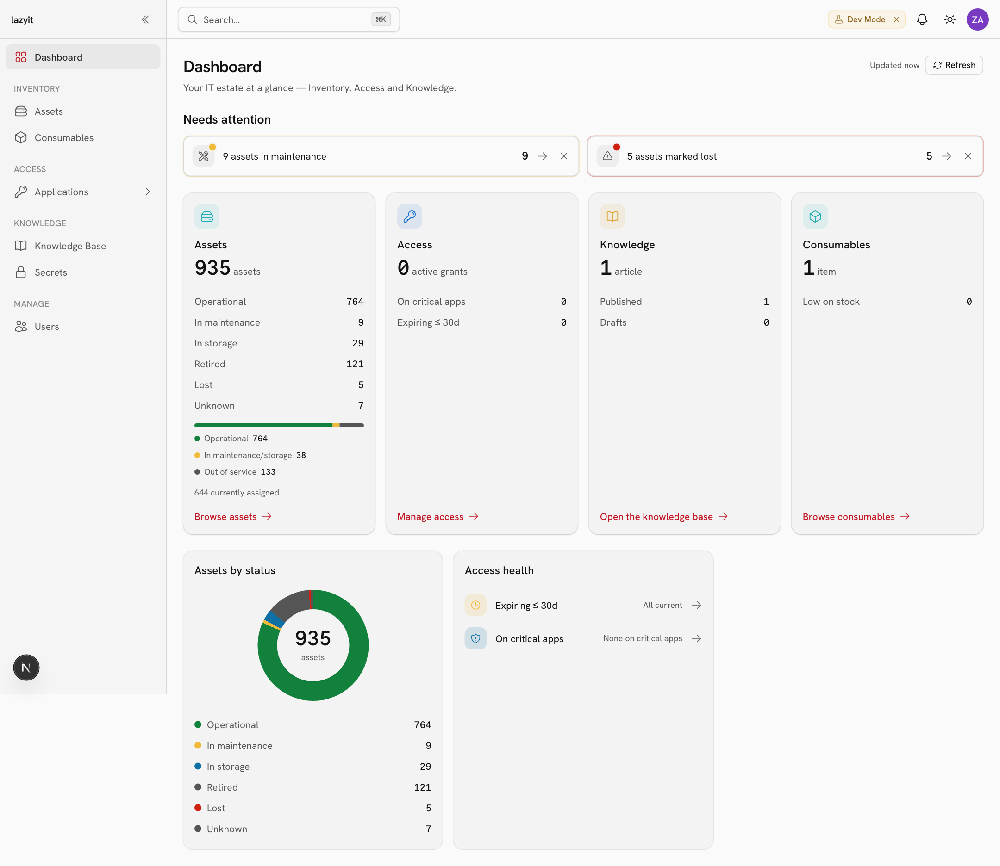
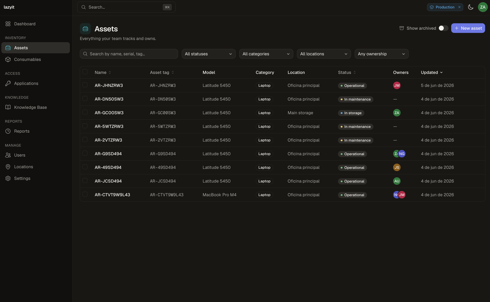
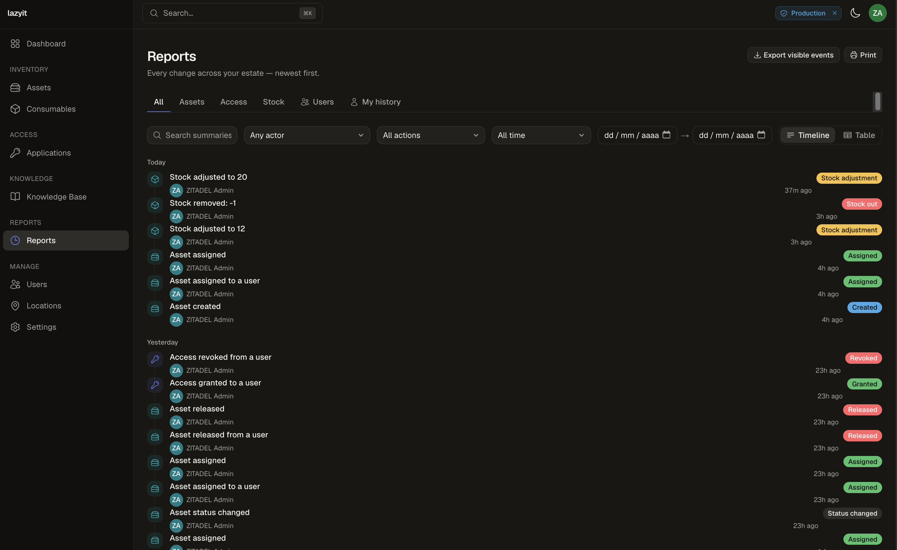
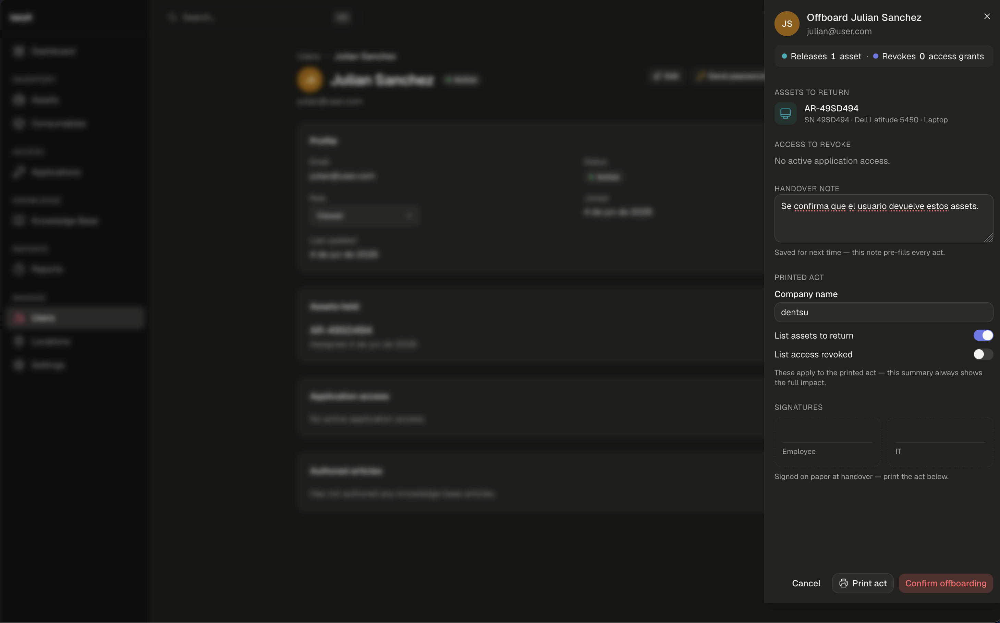
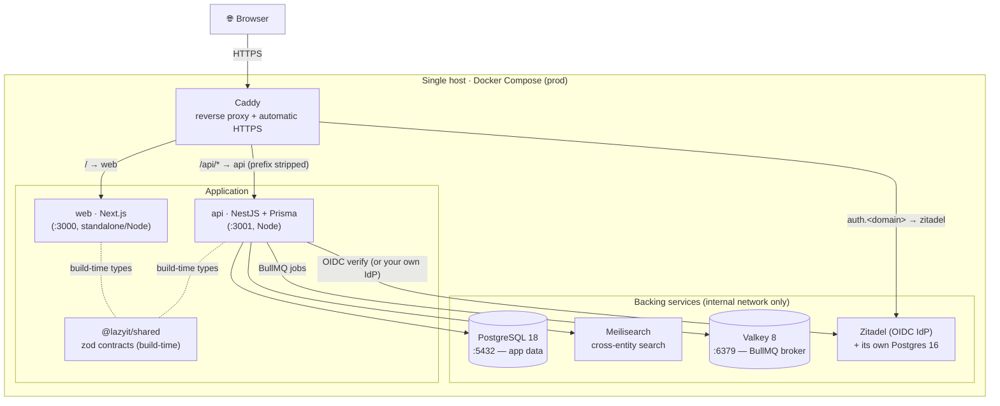

<p align="center">
  
</p>

<p align="center">
  <strong>The IT inventory & access tool small teams actually want to open.</strong><br/>
  Self-hosted. Asset-centric. Auditable by default.
</p>

<p align="center">
  <a href="LICENSE"></a>
  
  
  
</p>

---

## What is lazyit?

If you're 5–20 people who own *all* of a company's technology — the laptops, the
switches, the SaaS seats, the licenses, the cables and the toner — you already know the
problem. "What do we have, where is it, and who can touch it?" lives in three spreadsheets,
someone's memory, and a chat history nobody can search. People rotate; the knowledge of who
owned what walks out the door with them.

**lazyit is the single place to keep all of it.** Asset inventory, application access,
consumables, and a knowledge base — built *around IT objects*, not a generic ticketing tool
bent into shape. Think ServiceNow-grade capability, minus the enterprise weight and the price
tag, in something modern you'll actually want to use.

Two ideas run through everything:

- **Asset-centric.** The **asset** is the first-class citizen, not the user. Assets persist;
  people come and go. Ownership is a timestamped relationship, never a column — so the history
  of "who had this, and when" is automatic and never lost.
- **Auditable by default.** Nothing is hard-deleted (soft delete everywhere), and the history
  ledgers are append-only. "What changed, when, by whom?" always has an answer.

It's **self-hosted and single-org** by design — your inventory and access data is sensitive,
and it should live inside your company, on infrastructure a small team can actually operate
for years. Boring, durable technology. No Kubernetes required.

> [!NOTE]
> **The full documentation is an Obsidian vault in [`docs/`](docs/README.md) — and it's the
> source of truth.** This README is the front door; `docs/` is the house. When the two
> disagree, the docs win. Start at [`docs/README.md`](docs/README.md).

---

## Screenshots

<p align="center">
  <em>Dark mode · production UI — expand a view below to browse.</em>
</p>

<details open>
<summary><strong>Dashboard</strong> — pillar cards, live activity feed, and estate snapshot</summary>
<br/>
<p align="center">
  
</p>
</details>

<details>
<summary><strong>Assets</strong> — search, filter, and manage the full inventory</summary>
<br/>
<p align="center">
  
</p>
</details>

<details>
<summary><strong>Reports</strong> — estate-wide activity history with filters and export</summary>
<br/>
<p align="center">
  
</p>
</details>

<details>
<summary><strong>Offboarding</strong> — guided handover, assets to return, and printable act</summary>
<br/>
<p align="center">
  
</p>
</details>

<details>
<summary><strong>Workflows</strong> — visual builder & dry-run for per-app provisioning</summary>
<br/>
<!-- placeholder: replace brand/workflow-builder.png with a real capture of the box-diagram DAG builder + dry-run -->
<p align="center">
  
</p>
</details>

---

## Demo

> ▶ **Demo — coming soon.** A short walkthrough video is on the way. _(placeholder)_

---

## Features (what it does today)

Honest scope: this is what's **built and usable right now**, not a roadmap.

- 📦 **Assets & inventory** — the heart of it. Flexible, type-specific specs (laptops,
  servers, switches, licenses…), categories and models, locations, and a **timestamped
  assignment history** so ownership is never a guess.
- 🔑 **Application access** — register the apps/SaaS you run, then grant and (critically)
  **revoke** access per user, with an access map of who can touch what.
- ⚙️ **Applications Workflow Engine** — *opt-in, per application.* When access is granted or
  revoked, admin-configured **workflows** provision/deprovision the user in external systems
  (Jira, Redmine, any REST or webhook target). You wire them in a **visual box-diagram DAG
  builder** with first-class error handling — per-step success criteria, retries, and explicit
  success/failure edges — plus **manual (human-task)** steps, a **test-connection** check and a
  no-side-effect **dry-run** payload preview. An app with **no** workflow behaves exactly as
  today (granting just records the access grant); the engine fires *after* the grant commits,
  decoupled via a transactional outbox, so a failing external call never blocks or rolls it
  back. Gated by `workflow:*`.
- 🧰 **Consumables** — stock you burn through (cables, toner, adapters) tracked as an
  **append-only movement ledger**, so counts are always reconcilable.
- 📚 **Knowledge base** — internal articles with categories and versioning, for the runbooks
  that otherwise live in someone's head.
- 🛡️ **RBAC v2** — three fixed roles (`ADMIN` / `MEMBER` / `VIEWER`), but **what each role
  grants is configurable** by an admin from a closed permission catalog. Permissions are
  DB-first and **lazyit-local** — never synced to your IdP, so they survive a bring-your-own-IdP
  swap unchanged.
- 🤖 **Service accounts** — first-class **non-human** credentials for automation (CI, scripts,
  integrations). A lazyit-native token (`lzit_sa_…`, hashed at rest, shown once), authorized by
  direct permission grants, **never** ADMIN, **fail-closed**.
- 📊 **Reports / Informes** — an estate-wide, filterable **activity history**: who did what,
  to which entity, when — with CSV and print export.
- 🧾 **Printable offboarding act** — generate a clean, printable hand-over sheet (acta de baja)
  when an asset or a person leaves.

Authentication is **OIDC** against a self-hosted identity provider; **Zitadel is bundled** in
the stack, and because everything speaks standard OIDC you can **bring your own IdP** (Azure AD,
Okta, Keycloak, Authentik…) by changing three env vars — no code changes.

> [!NOTE]
> **Tickets** are in the domain model but **not implemented yet** — see
> [Known limitations](#known-limitations--mvp-caveats). We'd rather ship the inventory and
> access core solid than half-build everything.

---

## Architecture

Two apps that never import each other — they talk over HTTP — plus a shared contract package,
all behind a single reverse proxy in production.



**Auth has two shapes.** In production the API validates **OIDC** Bearer tokens (and the web
runs Auth.js v5). In local dev there's a zero-config **shim**: `AUTH_MODE=shim` resolves the
actor from an `X-User-Id` header instead of validating tokens, so you can run the whole stack
without bootstrapping Zitadel. The shim trusts a forgeable header — it is **dev/test only and
must never run in production.**

The API also runs **async workers on Valkey via BullMQ** — the **Applications Workflow Engine**
and the sandboxed, heap-capped **`.docx` knowledge-base import** — under the rule "BullMQ
executes; PostgreSQL remembers"
([ADR-0053](docs/03-decisions/0053-async-workers-bullmq-valkey.md) ·
[ADR-0054](docs/03-decisions/0054-applications-workflow-engine.md)).

Only Caddy publishes ports in prod; Postgres, Valkey, the API, the web app and Zitadel all stay
on the internal Docker network. Deep dive: [`docs/01-architecture/deployment.md`](docs/01-architecture/deployment.md)
· [`docs/01-architecture/stack.md`](docs/01-architecture/stack.md).

---

## Quick start (dev)

The fast, native loop: backing services in Docker, the apps on your machine via
[Bun](https://bun.sh).

**You'll need:** Bun `1.3.x` (the repo pins `1.3.14`), Docker + Docker Compose, and Node on
your PATH (some CLIs still expect it).

```sh
# 1. Install every workspace
bun install

# 2. Configure — copy each example and fill it in (there are THREE env files; see Configuration)
cp .env.example .env                     # root: POSTGRES_*, MEILI_MASTER_KEY, ZITADEL_* (dev IdP)
cp apps/api/.env.example apps/api/.env   # api:  DATABASE_URL, PORT, WEB_ORIGIN, MEILI_*, AUTH_MODE=shim
cp apps/web/.env.example apps/web/.env   # web:  NEXT_PUBLIC_API_URL + Auth.js vars

# 3. Start the backing services — Postgres + Meilisearch + Zitadel (+ its own Postgres)
bun run db:up                            # docker compose up -d (auto-merges compose.override.yaml)

# 4. Apply migrations + seed the initial asset categories (idempotent), from apps/api
cd apps/api && bunx prisma migrate dev && bunx prisma db seed && cd -

# 5. Run web + api together
bun run dev                              # web → http://localhost:3000 · api → http://localhost:3001
```

Then open **http://localhost:3000**. API docs (Swagger) live at **http://localhost:3001/api/docs**.

Other scripts: `bun run build` · `bun run lint` · `bun run test` · `bun run db:down`.

Full walkthrough and the Prisma workflow:
[`docs/04-development/setup.md`](docs/04-development/setup.md) ·
[`docs/05-runbooks/prisma-migrations.md`](docs/05-runbooks/prisma-migrations.md).

---

## Deploy (Docker)

Production runs **everything in containers behind Caddy with HTTPS**. The canonical
[`compose.yaml`](compose.yaml) defines every service; [`infra/docker-compose.prod.yaml`](infra/docker-compose.prod.yaml)
layers in the prod hardening, and the `prod` profile turns on the app containers (api, web, the
one-shot migrate job, Caddy, and the Zitadel bootstrap sidecar).

### Recommended: the guided bootstrap

The friendliest first boot is [`infra/start.sh`](infra/start.sh) — a guided, **idempotent and
non-destructive** wrapper. It detects your environment, asks ~6 questions, generates
`infra/env/.env.prod` with **strong random secrets** (including the famously fussy 32-byte
`ZITADEL_MASTERKEY`) in a `chmod 600` file, brings the stack up, and points you at the in-app
`/setup` wizard to create the first admin.

```sh
./infra/start.sh             # interactive, guided (recommended)
./infra/start.sh --yes       # non-interactive localhost defaults (smoke test)
./infra/start.sh --dry-run   # run all checks + prompts, write nothing, run no docker
```

### Or by hand

```sh
cp infra/env/.env.prod.example infra/env/.env.prod   # then replace every CHANGE_ME
chmod 600 infra/env/.env.prod                         # protect it on the host
docker compose -f compose.yaml -f infra/docker-compose.prod.yaml \
  --profile prod --env-file infra/env/.env.prod up -d --build
# open https://localhost:8443/setup
```

`--env-file` is required: the compose `environment:` blocks use `${VAR}` interpolation that
Compose resolves at parse time.

### Which path do I choose?

| You want to… | Use | Ports | Runbook |
| --- | --- | --- | --- |
| Develop day-to-day | `bun run dev` + backing services (`docker compose up`) | web `3000` · api `3001` · pg `5432` | [setup](docs/04-development/setup.md) |
| Validate the prod shape on your laptop | `--profile prod` with local HTTPS (Caddy internal CA) | `8080` / `8443` | [docker-prod-like-first-boot](docs/05-runbooks/docker-prod-like-first-boot.md) |
| Self-host on a real host + domain | same compose + Let's Encrypt + real secrets + backups | `80` / `443` | [deploy-self-hosted](docs/05-runbooks/deploy-self-hosted.md) |

More runbooks: [backups](docs/05-runbooks/backups.md) ·
[auth bootstrap](docs/05-runbooks/auth-bootstrap.md) ·
[build/boot troubleshooting](docs/05-runbooks/docker-build-troubleshooting.md) ·
[`infra/README.md`](infra/README.md).

---

## Configuration

lazyit uses **one `.env` per scope**, each with a committed `.env.example` you copy from.
The pattern is always the same: `cp <something>.env.example <something>.env`, then fill in.

| Scope | File | What it holds |
| --- | --- | --- |
| **Root** | `.env` | Postgres + Meili + the dev Zitadel block — read by Compose |
| **API** | `apps/api/.env` | `DATABASE_URL`, `PORT`, `WEB_ORIGIN`, Meili, `REDIS_URL` (Valkey/BullMQ), `WORKFLOW_SECRET_KEY` + the auth block (`AUTH_MODE`, `OIDC_*`) |
| **Web** | `apps/web/.env` | `NEXT_PUBLIC_API_URL` + the Auth.js v5 vars (`AUTH_SECRET`, `AUTH_ISSUER`, …) |

The variables you'll touch most:

| Variable | Where | Does what |
| --- | --- | --- |
| `AUTH_MODE` | `apps/api/.env` | `shim` = dev header auth (`X-User-Id`); **unset = OIDC mode (production)** |
| `DATABASE_URL` | `apps/api/.env` | Postgres connection for Prisma + the API runtime |
| `REDIS_URL` | `apps/api/.env` | Valkey connection for the BullMQ async workers (dev: `redis://127.0.0.1:6379`; prod: `redis://valkey:6379`) |
| `WORKFLOW_SECRET_KEY` | `apps/api/.env` (prod) | 32-byte key (64 hex, `openssl rand -hex 32`) for the workflow secret store — **fail-loud at boot**, a **DR linchpin** alongside `POSTGRES_PASSWORD` / `ZITADEL_MASTERKEY` (losing it loses every stored connector credential) |
| `NEXT_PUBLIC_API_URL` | `apps/web/.env` | Where the browser reaches the API (dev: `http://localhost:3001`; prod: `/api`, baked at build) |
| `MEILI_MASTER_KEY` / `MEILI_HOST` | root + `apps/api/.env` | Meilisearch auth + URL (must match between scopes) |
| `OIDC_ISSUER` / `AUTH_ISSUER` (+ client id/secret) | api / web | Your identity provider — the three vars you change for bring-your-own-IdP |
| `LAZYIT_HTTP_PORT` / `LAZYIT_HTTPS_PORT` | `infra/env/.env.prod` | The ports Caddy publishes (default `8080` / `8443`) |

A few rules worth internalizing:

- Bun auto-loads `.env` for tooling, so there's **no `dotenv` in app code**. Two things load
  env explicitly because they run outside Bun: `prisma.config.ts` (Prisma CLI on Node) and the
  API runtime (`nest start --env-file .env`).
- Keep `DATABASE_URL`'s credentials in sync with the root Postgres vars, and `MEILI_MASTER_KEY`
  in sync between the root and api scopes.

> [!WARNING]
> **Production must never run `AUTH_MODE=shim`.** The shim trusts a forgeable header and is
> dev/test only. In prod, leave `AUTH_MODE` unset (OIDC mode). The prod env template ships with
> the secure default.

Full reference: [`docs/04-development/setup.md`](docs/04-development/setup.md) (env section) ·
[`docs/01-architecture/auth-zitadel-sot.md`](docs/01-architecture/auth-zitadel-sot.md).

---

## Choices you'll make (and what we recommend)

lazyit is opinionated, but the load-bearing decisions are yours to flip — usually with a couple
of env vars, never a code change.

| Decision | Options | Our default · recommendation |
| --- | --- | --- |
| **Identity provider** | Bundled **Zitadel** vs **bring-your-own-IdP** (Azure AD, Okta, Keycloak, Authentik…) | Bundled Zitadel — zero-touch, provisioned automatically. Switch to your own IdP with 3 env vars, no code. |
| **Auth mode** | `shim` vs **OIDC** | Shim for local dev convenience; **OIDC in production, always.** |
| **Compose profile** | dev backing services vs `--profile prod` (full containerized stack) | Native `bun run dev` while building; `--profile prod` to validate or self-host. |
| **Published ports** | dev `3000`/`3001`/`5432` · prod `8080`/`8443` (local) or `80`/`443` (domain) | Keep the high local-prod ports so they never clash with dev; standard ports on a real domain. |
| **Permissions** | Fixed roles, **editable role→permission matrix** | Sensible defaults out of the box; an admin tunes the matrix without touching the IdP. |

Worth reading before you decide:
[ADR-0037 — IdP choice & BYOI](docs/03-decisions/0037-idp-choice-zitadel-byoi.md) ·
[ADR-0039 — Auth.js v5 frontend OIDC](docs/03-decisions/0039-authjs-v5-frontend-oidc.md) ·
[ADR-0046 — roles & permissions v2](docs/03-decisions/0046-roles-permissions-v2.md) ·
[ADR-0048 — service accounts](docs/03-decisions/0048-service-accounts.md) ·
[ADR-0009 — Bun vs the app stack](docs/03-decisions/0009-bun-first-vs-app-stack.md) ·
[ADR-0053 — async workers (BullMQ/Valkey)](docs/03-decisions/0053-async-workers-bullmq-valkey.md) ·
[ADR-0054 — Applications Workflow Engine](docs/03-decisions/0054-applications-workflow-engine.md).

---

## Known limitations & MVP caveats

We'd rather be honest than oversell. lazyit is an **MVP that's finishing its polish**, and a few
things are deliberately not here yet:

- **Tickets aren't implemented.** They live in the domain model but there's no ticketing UI or
  API yet. The inventory + access core came first, on purpose.
- **English only.** The UI is English for now; Spanish/i18n is **deferred to its own future ADR**.
- **Reports (Informes) are v1.** The activity history works, but some filters are first-pass, and
  the access gate on the page is a **UI-level** restriction (the underlying feed isn't yet
  permission-scoped end-to-end) — fine for an internal small-team deploy, on the list to harden.
- **Async workers are built — and the workflow engine is new.** Background work runs on
  **BullMQ over self-hosted Valkey** ([ADR-0053](docs/03-decisions/0053-async-workers-bullmq-valkey.md)):
  it powers the **Applications Workflow Engine**
  ([ADR-0054](docs/03-decisions/0054-applications-workflow-engine.md)) and the sandboxed,
  heap-capped **`.docx` import**. The engine is freshly shipped and still polishing — run/task
  status is **polled** (no realtime notification bell yet), and v1 connectors are public-HTTPS
  **REST / WEBHOOK_OUT / MANUAL** only. **On-prem/internal-target connectors and timer/scheduled
  triggers are future**, and the manual-task inbox is a provisioning queue, not a generic
  ticketing/approval system.
- **A couple of background jobs are still future.** UI-triggered scheduled backups and low-stock
  consumable alerts aren't built yet — the queue substrate is now in place for them. The backup
  sidecar still runs on cron in the container, not from the app.
- **Backups are semi-manual.** The opt-in backup sidecar does scheduled `pg_dump`s to a host
  directory; offsite copy is an optional hook you wire yourself. No one-click restore from the UI.
- **The dev auth shim is dev-only.** It's a convenience, not a feature — see the warnings above.
- **No CD pipeline yet.** CI gates every PR (typecheck, lint, test, build, image build), but
  there's no automated deploy target; images aren't published anywhere yet.

None of this is scary — it's a focused tool that does its core job well and tells you where the
edges are. Deferred items are tracked in [`docs/`](docs/README.md) (see the per-folder `_MOC.md`
indexes and the open ADRs).

---

## License

**MIT** — you're free to use, modify, self-host, and commercialize lazyit. See [`LICENSE`](LICENSE).

© 2026 Joaquin Minatel.

---

## Documentation

The real documentation is the Obsidian vault in **[`docs/`](docs/README.md)** — vision and
problem-space, the architecture and stack, the asset-centric domain model, every ADR (the *why*
behind each decision), the setup guide, and the operations runbooks. **It's the source of truth;**
start at [`docs/README.md`](docs/README.md).

> [!NOTE]
> **Status:** lazyit is a personal project at the MVP stage — built in the open, finishing its
> refinement, and validated internally before any wider release. Expect rough edges, honest
> docs, and steady progress.
