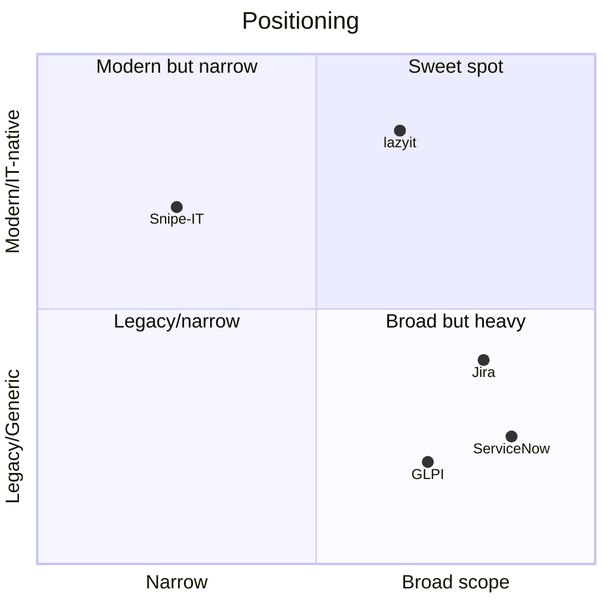

# Competitors & Landscape

How lazyit relates to the tools a small IT team might otherwise reach for.

| Tool | Category | Strength | Why it doesn't fit our user |
| --- | --- | --- | --- |
| **ServiceNow** | ITSM suite | Complete, enterprise-grade | Expensive, heavy, legacy UX; over-scoped for 5–20 people |
| **Jira / Linear** | Issue tracking | Great workflows & UX | Generic; no native concept of assets, access, consumables |
| **Snipe-IT** | Asset inventory | Solid, open-source inventory | Inventory only; no access management, knowledge base, provisioning automation, or secret/credential vault |
| **GLPI** | ITSM (open source) | Broad, free | Dated UX; configuration-heavy; steep to operate well |
| **Freshservice** | ITSM SaaS | Modern, approachable | SaaS-only; pricing scales with agents; not self-hosted |
| **Spreadsheets / Notion** | Ad hoc | Zero cost, flexible | No model, no automation, no audit trail; breaks at scale |

## Where lazyit sits

lazyit intentionally occupies the gap between **narrow** (Snipe-IT) and **heavy/generic**
(ServiceNow, Jira): one opinionated, IT-native, self-hosted app that unifies inventory +
access + consumables + knowledge + credentials, with auditability by default.

One capability usually reserved for the heavy suites it now also has, on its own honest terms:
**provisioning automation** — an opt-in, per-application [[workflow-engine/_MOC|Workflow Engine]]
that drives access provisioning/deprovisioning into external systems (Jira, Redmine, any REST or
webhook target) when access is granted or revoked in lazyit. It is new and deliberately scoped
(public-HTTPS REST/webhook/manual steps, event triggers) — not a general-purpose no-code automation
canvas, and apps without a workflow keep behaving exactly as before.

And none of the tools above ships a **credential vault** at all: a team using ServiceNow, Jira,
Snipe-IT, GLPI or a spreadsheet still reaches for a *separate* password manager for shared
secrets. lazyit folds that in as a **zero-knowledge Secret Manager** — credentials vaults living
beside the KB where the server stores secrets encrypted and can never decrypt a stored value
([[0061-secret-manager-zero-knowledge]]) — so the credential store is part of the system of record,
not one more tool outside it.

> [!note] This is a positioning sketch, not market research. Revisit with real data before
> using it in any external material.

Related: [[problem-space]] · [[vision]]
