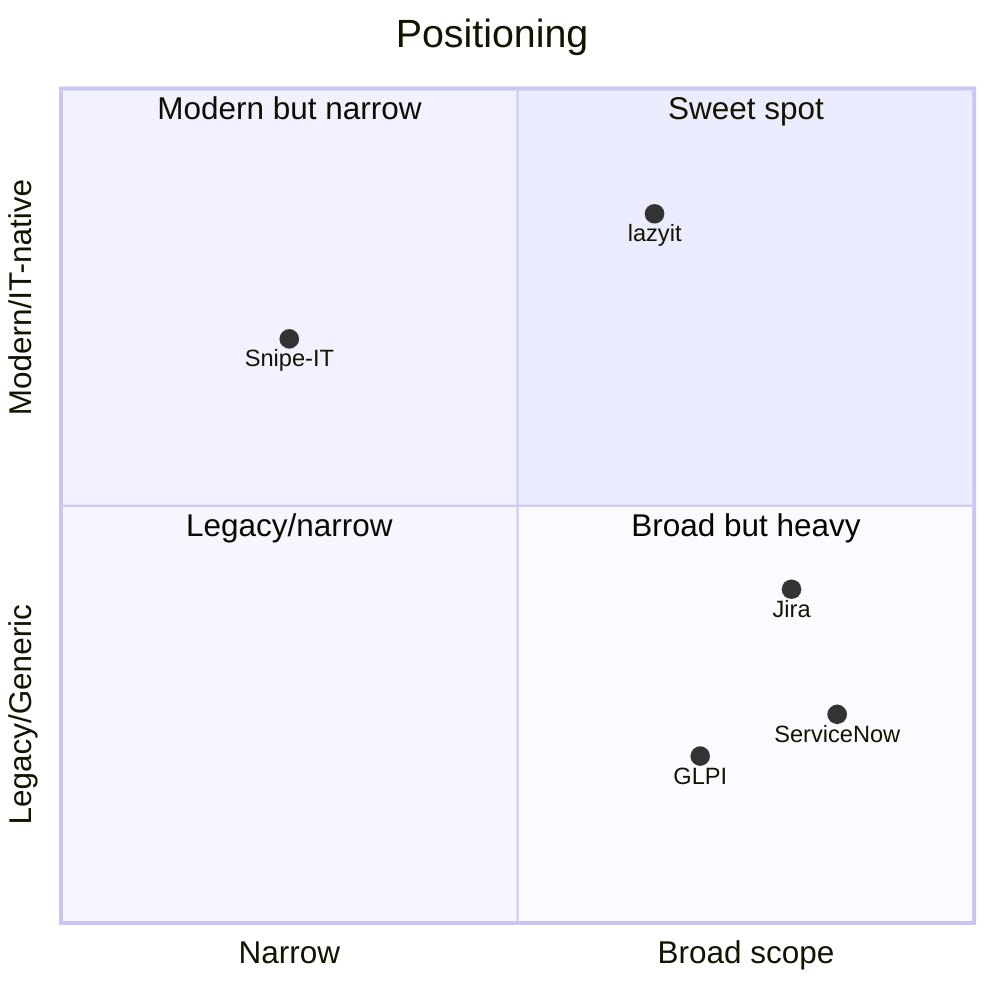

# Competitors & Landscape

How lazyit relates to the tools a small IT team might otherwise reach for.

| Tool | Category | Strength | Why it doesn't fit our user |
| --- | --- | --- | --- |
| **ServiceNow** | ITSM suite | Complete, enterprise-grade | Expensive, heavy, legacy UX; over-scoped for 5–20 people |
| **Jira / Linear** | Issue tracking | Great workflows & UX | Generic; no native concept of assets, access, consumables |
| **Snipe-IT** | Asset inventory | Solid, open-source inventory | Inventory only; no tickets, access, or knowledge base |
| **GLPI** | ITSM (open source) | Broad, free | Dated UX; configuration-heavy; steep to operate well |
| **Freshservice** | ITSM SaaS | Modern, approachable | SaaS-only; pricing scales with agents; not self-hosted |
| **Spreadsheets / Notion** | Ad hoc | Zero cost, flexible | No model, no automation, no audit trail; breaks at scale |

## Where lazyit sits

lazyit intentionally occupies the gap between **narrow** (Snipe-IT) and **heavy/generic**
(ServiceNow, Jira): one opinionated, IT-native, self-hosted app that unifies inventory +
access + tickets + consumables + knowledge, with auditability by default.

> [!note] This is a positioning sketch, not market research. Revisit with real data before
> using it in any external material.

Related: [[problem-space]] · [[vision]]
