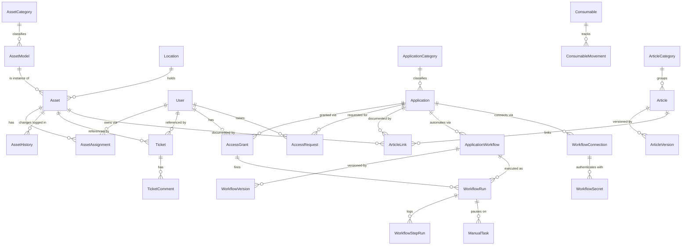

# Domain — Map of Content

What lazyit models and the rules that govern it.

- [[asset-centric]] — the core design philosophy: the **Asset** is the first-class citizen.
- [[conventions]] — technical conventions for the data model (naming, IDs, timestamps,
  soft delete, flexible specs).
- [[entities/_MOC|Entities]] — one conceptual note per entity.

## Domain shape

> [!note] Conceptual ERD. Relationships only — no fields. `Asset ↔ User` via
> `AssetAssignment` is **concurrent many-to-many** (multiple active owners allowed; see
> [[asset-assignment]]). Field definitions arrive when entities land in Prisma.

## Bounded areas

The model is organized in loosely-coupled areas:

1. **Assets (core)** — [[asset]], [[asset-model]], [[asset-category]], [[location]],
   [[asset-assignment]], [[asset-history]].
2. **People** — [[user]] (central to access, peripheral to assets).
3. **Tickets** — [[ticket]], [[ticket-comment]] (cross-cutting).
4. **Access** — [[application]], [[application-category]], [[access-grant]], [[access-request]].
5. **Consumables** — [[consumable]], [[consumable-movement]].
6. **Knowledge base** — [[article]], [[article-category]], [[article-version]], [[article-link]].
7. **Workflow engine** — [[application-workflow]], [[workflow-connection]], [[workflow-version]],
   [[workflow-run]], [[workflow-step-run]], [[manual-task]], [[workflow-secret]] (an opt-in extension
   of **Access** — [[0054-applications-workflow-engine]]).

## Implementation order

The model is built atomic-first (see each entity note for status):

1. [[user]] + [[location]] — no dependencies.
2. [[asset-model]] + [[asset-category]] + [[asset]] — the core.
3. [[asset-assignment]] + [[asset-history]] — traceability.
4. [[ticket]] + [[ticket-comment]].
5. [[application]] + [[application-category]] + [[access-grant]] + [[access-request]].
6. [[consumable]] + [[consumable-movement]].
7. [[article]] + [[article-category]] + [[article-version]] + [[article-link]].
8. **Workflow engine** (opt-in, after Access) — [[application-workflow]] + [[workflow-connection]] +
   [[workflow-version]] + [[workflow-run]] + [[workflow-step-run]] + [[manual-task]] +
   [[workflow-secret]] ([[0054-applications-workflow-engine]], epic #248).

Why asset-centric? → [[0004-asset-centric-design]].
