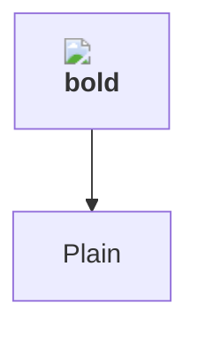

# SEC-084 — Mermaid HTML labels load remote images for KB readers

## Summary

`MermaidDiagram` set `flowchart: { htmlLabels: false }` to keep diagram labels as SVG text. Since
mermaid 11.12.3 that option is deprecated, and in mermaid 12 it does not stop flowchart **node**
labels rendering as HTML inside a `<foreignObject>`. Strict mode still sanitises the markup (no event
handlers, no `javascript:` links), but it keeps ``. A KB author can therefore put a
remote image in a node label, and every reader who opens the article loads it: a tracking pixel.
KB Markdown drops external images on purpose (ADR-0082 §5), so the diagram path bypassed that rule.

Found during the Mermaid 12 upgrade (PR #1429). Filed and fixed in the same change.

## Description

- `apps/web/components/markdown-mermaid.tsx` initialised mermaid with `securityLevel: "strict"` and
  `flowchart: { htmlLabels: false }`. The component comment and ADR-0021 both say HTML labels are off.
- In mermaid 12 the node shapes read only the root option, defaulting to HTML
  (`evaluate(config.htmlLabels) ?? true`, `config.htmlLabels ?? true` in the shape code). Only
  `getEffectiveHtmlLabels`, used for edge labels, still falls back to the deprecated
  `flowchart.htmlLabels`. So edge labels rendered as SVG text and node labels as HTML.
- `htmlLabels` is not in mermaid's default `secure` list. Even with the root option set, a diagram's
  `%%{init: {"htmlLabels": true}}%%` directive or front-matter `config: {htmlLabels: true}` turns HTML
  labels back on.
- The web CSP is `frame-ancestors 'none'` only (`apps/web/next.config.ts`), and Caddy sets no CSP, so
  nothing restricts `img-src`. The browser fetches the remote image.

## Impact

Anyone who can write a KB article (an authenticated MEMBER or ADMIN) can learn which colleagues open it,
and when. The request to the author's host carries the reader's IP address, User-Agent, time of access,
and the lazyit origin (`Referrer-Policy: strict-origin-when-cross-origin`). This is information
disclosure to the author and a way round the ADR-0082 rule that KB articles load no external images.

It is **not** script execution: strict mode strips `onerror` and `javascript:` hrefs, and the probe
below confirms it. The author is an internal, authenticated user, and the leak is limited to request
metadata. Low.

## Proof of concept

Rendered in Chromium with the shipped mermaid 12.0.0 bundle and the pre-fix config
(`securityLevel: "strict"`, `flowchart: { htmlLabels: false }`), light and dark themes:

````markdown

````

Result: 4 `<foreignObject>` labels, 1 `` in the DOM, and the browser requested
`https://example.invalid/pixel.png`. No `onerror` and no `javascript:` survived.

With the root `htmlLabels: false` alone, the same source prefixed by `%%{init: {"htmlLabels": true}}%%`
or by `---\nconfig:\n  htmlLabels: true\n---` still produced 3 `<foreignObject>` labels and an ``.

## Affected

- `apps/web/components/markdown-mermaid.tsx` (`loadMermaid`, the `mermaid.initialize` config)
- Every surface that renders KB Markdown through `MarkdownView` with a ` ```mermaid ` fence: the article
  view and the editor preview. The AI chat does not render mermaid (security.md, W3-7).

## Recommendation

Set the root `htmlLabels: false` and add `htmlLabels` to `secure`, keeping mermaid's default secure
keys. Pin both in a unit test.

## Prevention

When upgrading mermaid, check its deprecation warnings (`FLOWCHART_HTML_LABELS_DEPRECATED`) and any
security-relevant option against the rendered DOM, not only against the config types. Any render
option that decides whether author content becomes HTML must be listed in `secure`, so that a
diagram's own config cannot override it.

## References

- CWE-359 (exposure of private personal information), the tracking-pixel class.
- Mermaid config docs: root `htmlLabels` ("Diagram-specific `htmlLabels` settings … are deprecated. The
  root-level `htmlLabels` takes precedence"); `secure` keys.
- ADR-0021 (KB rendering: "no click-handlers/HTML labels"), ADR-0082 §5 (KB drops external images),
  SEC-003 (stored XSS class; the sanitizer boundary is unchanged).

## Resolution

**Status**: fixed
**Fixed in**: commit `a85be47d` (`fix(web): Mermaid labels render as SVG text, not HTML (SEC-084)`)
**Fixed by**: lazyit-remediator
**Date**: 2026-09-25

### Changes
- `apps/web/components/markdown-mermaid.tsx`: `mermaid.initialize` sets the root `htmlLabels: false`
  (the deprecated `flowchart.htmlLabels` is removed) and `secure: [...MERMAID_DEFAULT_SECURE_KEYS,
  "htmlLabels"]`, so neither a `%%{init}%%` directive nor front-matter config can re-enable HTML
  labels, at the root or under `flowchart`. The security comment now describes what the code does.
- `apps/web/content/manual/{en,es}/knowledge-base-articles-authoring.md`: diagram labels are plain
  text; HTML tags show as written, and `<br>` still breaks a line.

### Tests added
- `apps/web/components/markdown-mermaid.test.ts`::"labels render as SVG text and a diagram cannot
  re-enable HTML (dark=false|true)". It fails without the fix (`htmlLabels` is `undefined` and there is
  no `secure` list) and passes with it.

### Verification
Chromium (Playwright, `/opt/pw-browsers/chromium-1194`) with the mermaid 12.0.0 bundle and the fixed
config, light and dark: the probe flowchart has 0 `<foreignObject>`, 0 ``, and no outbound request;
the `` markup shows as literal text. The four override variants (root and `flowchart` keys, via
directive and via front matter) all stay at 0 `<foreignObject>`. Flowchart (including a markdown
string), sequence (with `<br>`), class and state diagrams render correctly in both themes.
`bun test` for the file passes (6), `tsc` for `apps/web` passes, and scoped eslint is clean.

### Residual risk
None for labels. The web still has no content CSP (`img-src` is unrestricted), as tracked in
`apps/web/next.config.ts`. A future render path that emits author HTML would load remote images again,
so the CSP pass remains the defence-in-depth follow-up.
